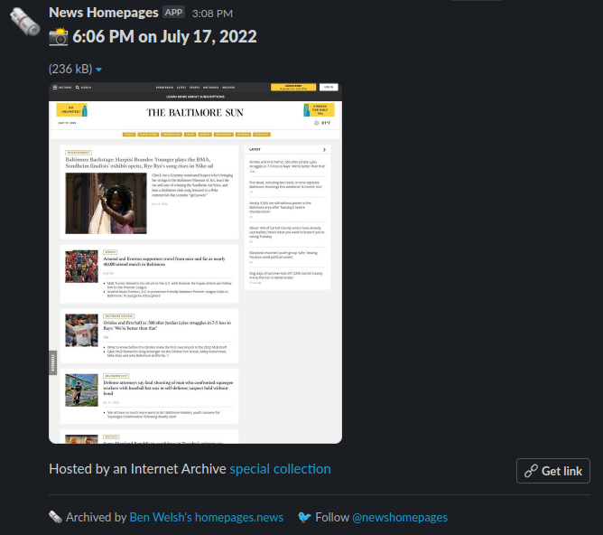

```{include} _templates/nav.html
```

# Adding a Slack bot

The News Homepages [open-source system](https://github.com/palewire/news-homepages) supports the creation of bots that post a site's latest screenshots into a private [Slack](https://en.wikipedia.org/wiki/Slack_(software)) channel.

The tool is used by the [Baltimore Sun](https://twitter.com/palewire/status/1549023007942877188), [Atlanta Journal-Constitution](https://twitter.com/palewire/status/1549105426511253504), [Los Angeles Times](https://twitter.com/palewire/status/1549421047610757120) and [Toronto Globe and Mail](https://twitter.com/palewire/status/1552404809411706881) to save and share images each day. Here's what it looks like:



Our maintainers are happy to supply a similar bot to any newsroom that wants one. Here's what it takes.

```{note}
If you're not comfortable with the technical tools described below, reach out to project maintainer Ben Welsh for help. You can do this by emailing [b@palewi.re](mailto:b@palewi.re) or sending him a direct message on Twitter at [@palewire](https://twitter.com/palewire). We want you to get your bot and will do what we can to make it happen.
```

## 1. An incoming Slack webhook

Incoming webhooks are Slack's simplest way to support automatic posts from outside sources. The official Slack documentation walks you through [how to create one](https://slack.com/help/articles/115005265063-Incoming-webhooks-for-Slack). Follow the instructions there.

Create a channel with a name like "#homepage-screenshots" and connect it to the webhook. You can name the app whatever you'd like, though our recommendation is to name it "News Homepages" and use [our logo from Twitter](https://twitter.com/newshomepages).

The process will yield a webhook URL with the authority to post into the channel. Save it for later.

## 2. Create an Actions workflow

[GitHub Actions](https://github.com/features/actions) is a free framework for running scheduled tasks with open-source code. It is used by our system to gather and save screenshots. The files that configure the runs are stored in the code repository's [`.github/workflows`](https://github.com/palewire/news-homepages/tree/main/.github/workflows) directory.

Create a new file there named `archive-your-site-handle.yml` and paste in our generic bot instructions.

```yaml
name: "Archive and Slack: Your Site Name"

on:
  workflow_dispatch:
  schedule:
    - cron: "0 10,16,22 * * *"

jobs:
  archive-site:
    name: Archive bundle
    uses: palewire/news-homepages/.github/workflows/reusable-archive-single-site-workflow.yml@main
    with:
      handle: your-site-handle
    secrets: inherit

  newsroom-slack:
    name: Post to newsroom Slack
    runs-on: ubuntu-latest
    timeout-minutes: 15
    needs: [archive-site]
    steps:
      - id: checkout
        name: Checkout
        uses: actions/checkout@v3

      - id: slack
        name: Post to Slack
        uses: ./.github/actions/slack
        with:
          handle: your-site-handle
          webhook-url: ${{ secrets.SLACK_WEBHOOK_URL_YOUR_SITE_HANDLE_IN_CAPS }}
```

You should tailor the `name` setting to match your site. There are two `handle` inputs in the jobs section that should be edited to match your site's Twitter handle.

You'll also want to configure the `cron` setting to match whatever schedule you'd like the archiver to run on. If you're unfamiliar with the syntax, [GitHub's official documentation](https://futurestud.io/tutorials/github-actions-trigger-builds-on-schedule-cron) offers some guidance.

Finally, the `webhook-url` setting is where we will input the URL created in step one. Since the URL would allow anyone to post into your channel, we need to keep it out of our open-source code. This can be accomplished by storing it as an [encrypted secret](https://docs.github.com/en/actions/security-guides/encrypted-secrets) in our GitHub repository. Since only the maintainers of the project have the authority to do that, you will need to get in contact with them privately. You can do this by emailing Ben Welsh at [b@palewi.re](mailto:b@palewi.re) or sending him a direct message on Twitter at [@palewire](https://twitter.com/palewire).

## 3. Submit a pull request

You should then submit a pull request to the GitHub code repository proposing the addition of your workflow file. If you've never done this before, [GitHub has a guide](https://docs.github.com/en/pull-requests/collaborating-with-pull-requests/proposing-changes-to-your-work-with-pull-requests/creating-a-pull-request).

And that's it. Even if it's your first time working with GitHub, the process can probably be accomplished in a few hours.
